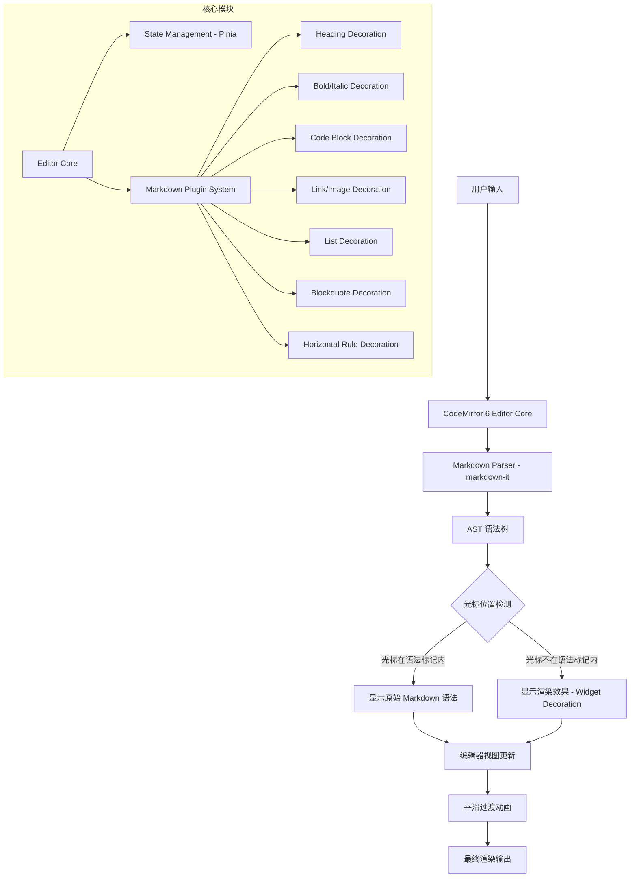

# Markdown 即时渲染编辑器 - 项目设计文档

## 1. 系统架构

## 2. 技术选型

| 层级 | 技术 | 说明 |
|------|------|------|
| 框架 | Vue 3 + Vite | SFC + Composition API |
| 编辑器引擎 | CodeMirror 6 | 高性能、可扩展的代码编辑器 |
| Markdown 解析 | markdown-it | 快速、可扩展的 Markdown 解析器 |
| 状态管理 | Pinia | 编辑器状态管理 |
| 样式 | SCSS | 自定义主题 |
| 构建 | Vite | 快速构建 |

## 3. 核心设计思路

### 即时渲染原理

1. **CodeMirror 6 Decoration 系统**：利用 CM6 的 `Decoration.replace` 和 `Decoration.widget` 在编辑器内直接替换/装饰文本
2. **光标感知**：通过 `ViewPlugin` 监听光标位置变化，判断光标是否在某个 Markdown 语法节点内
3. **平滑切换**：当光标进入/离开语法区域时，通过 CSS transition 实现渲染态和编辑态的平滑过渡
4. **无损编辑**：底层始终保持原始 Markdown 文本，渲染仅是视觉层的 Decoration

### 支持的 Markdown 语法

- **Heading** (h1-h6)：隐藏 `#` 标记，显示不同字号
- **Bold/Italic**：隐藏 `**` / `*` 标记，显示加粗/斜体
- **Strikethrough**：隐藏 `~~` 标记，显示删除线
- **Inline Code**：隐藏反引号，显示代码样式
- **Code Block**：隐藏围栏标记，显示代码块样式
- **Link**：隐藏语法，显示可点击链接
- **Image**：隐藏语法，显示图片预览
- **List**：美化列表标记
- **Blockquote**：美化引用样式
- **Horizontal Rule**：渲染分割线
- **Table**：渲染表格样式

## 4. 导出链路设计

### 模块划分

| 模块 | 职责 |
|------|------|
| `src/services/exporter.js` | 纯逻辑层：下载、剪贴板复制、分享摘要生成、本地文件读取；所有边界（空文档/超长/失败/取消）统一在此抛出 |
| `src/stores/export.js` | 导出状态机 `idle → working → done/error/cancelled → idle`；`begin()` 防重入；历史记录仅写入成功项 |
| `src/components/ExportMenu.vue` | 工具栏导出下拉：三种导出 + 打开文稿 + 最近导出记录 |
| `src/components/SummaryDialog.vue` | 摘要对话框四态：进度（可取消）/ 结果 / 错误 / 关闭 |
| `src/App.vue` | 编排层：空文档拦截 → 防重入 → 分发执行 → 统一异常收尾 |

### 关键决策

1. **内容一致性**：导出前实时调用 `editorView.state.doc.toString()`，不经过任何缓存，保证导出内容 = 当前编辑状态
2. **保存提示一致**：下载成功 / 打开文稿后调用 `markSaved()`；复制与摘要不影响 dirty 状态；状态栏常驻"未保存/已保存"指示
3. **可取消的摘要生成**：分块扫描（每 200 行让出主线程）+ `AbortController`，取消抛 `AbortError`，调用方静默收尾
4. **打开文稿可撤销**：载入为单个 CM6 替换事务，`Ctrl+Z` 可恢复，编辑器插件与后续编辑不受影响
5. **不产生空白文件/重复记录**：空文档在入口处拦截；失败与取消不写历史；`begin()` 保证同一时刻只有一个导出任务

## 5. UI/UX 规范
| 属性 | 值 |
|------|-----|
| 主色调 | #1a73e8 |
| 背景色 | #ffffff (编辑区) / #f8f9fa (侧边栏) |
| 字体 | -apple-system, "Segoe UI", "Noto Sans SC", sans-serif |
| 代码字体 | "JetBrains Mono", "Fira Code", monospace |
| 正文字号 | 16px |
| 行高 | 1.75 |
| 圆角 | 8px |
| 阴影 | 0 2px 8px rgba(0,0,0,0.08) |
